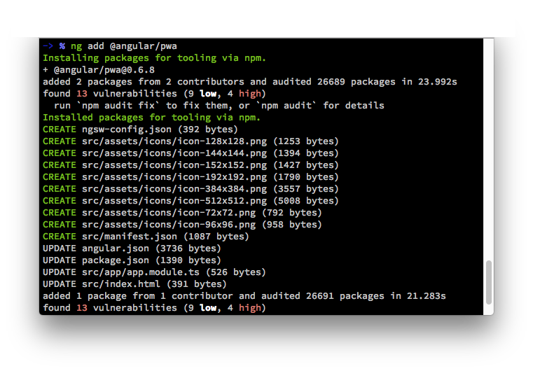
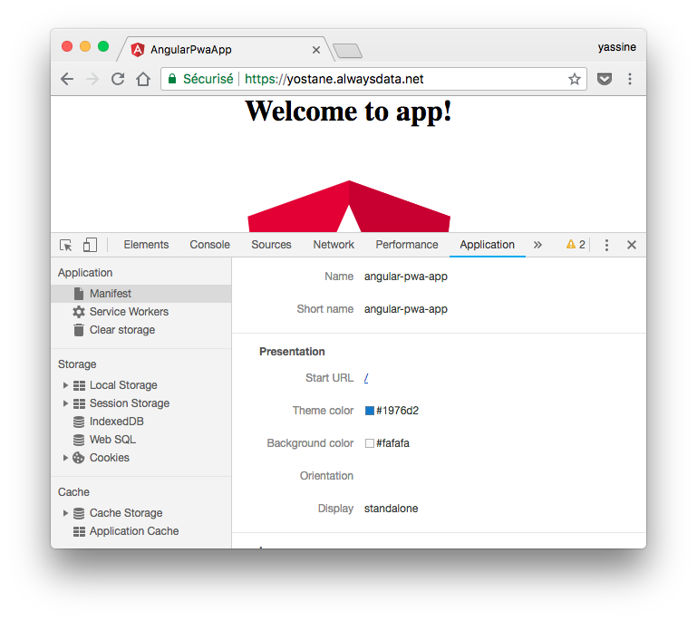
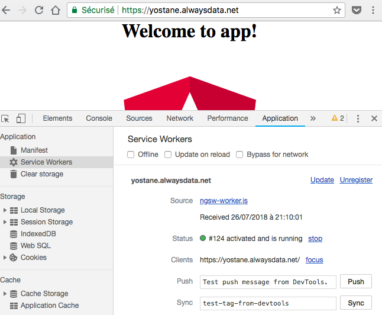

# Turning an Angular 6 app into a Progressive Web App

This article shows how to add PWA (Progressive Web App) capabilities to your Angular 6 app. (_spoil: it's easy_ 😍 )


We will go through the following steps:

1.  Adding PWA capabilities to an Angular app
2.  Filling the manifest
3.  Configuring the service worker
4.  Verifying and testing

In the following, we will be using Angular 6 and I suppose that you already have created an Angular app.

We will start right away by adding PWA capabilities to an existing Angular app.

## Adding PWA capabilities to an Angular app

Angular CLI 6 allows to add PWA capabilities to an existing Angular app. To do that, simply open a terminal on the root of the project and type the following command.

```shell
ng add @angular/pwa
```

You should see an output similar to the following one:

```shell
-> % ng add @angular/pwa
Installing packages for tooling via npm.
+ @angular/pwa@0.6.8
added 2 packages from 2 contributors and audited 26689 packages in 23.992s
CREATE ngsw-config.json (392 bytes)
CREATE src/assets/icons/icon-128x128.png (1253 bytes)
CREATE src/assets/icons/icon-144x144.png (1394 bytes)
CREATE src/assets/icons/icon-152x152.png (1427 bytes)
CREATE src/assets/icons/icon-192x192.png (1790 bytes)
CREATE src/assets/icons/icon-384x384.png (3557 bytes)
CREATE src/assets/icons/icon-512x512.png (5008 bytes)
CREATE src/assets/icons/icon-72x72.png (792 bytes)
CREATE src/assets/icons/icon-96x96.png (958 bytes)
CREATE src/manifest.json (1087 bytes)
UPDATE angular.json (3736 bytes)
UPDATE package.json (1390 bytes)
UPDATE src/app/app.module.ts (526 bytes)
UPDATE src/index.html (391 bytes)
```



We can see that the command created a bunch of files and updated some. In the following, I'll try to quickly explain what happened.

- **ngsw-config.json**: is a configuration file for the service worker. This file will be used by ng-cli when it needs to create the service worker file. It is mainly used to configure the different caching strategies.
- **icon-xxx.png**: the app icon in different resolutions. These icons are used by the PWA manifest. The icons are used for example as the app icon and inside the splash-screen.
- **manifest.json**: the PWA manifest. It provides metadata about the web app. It contains for example the icon and the name of the app.
- The updated files allow to take into account the service worker and the manifest in the Angular app. If we open **index.html**, we can note that it references the manifest in its head tag. These updates are necessary to consider the app as a PWA by a browser. The PWA features won't be enabled if we omit to reference them in the web app Even if the service worker and manifest files exist.

The angular-cli already filled the manifest and the service worker configuration with some data. It also created assets with the Angular logo. The next step consist of replacing the logo with our own. In addition to that, we also will modify the manifest and the service worker configuration to fit our needs.

In the next step, we will update the manifest.

## Filling the manifest

The manifest file contains some metadata used when installing the PWA and when it needs to display a splash screen. In fact, a PWA that is launched from the home-screen will display a splash screen.

Here is the description of some manifest fields. [A more exhaustive list can be found here](https://pwa-workshop.js.org/1-manifest/):

- `name` - displayed on the splash-screen below the app icon
- `short_name` - displayed below the shortcut on the desktop or on the home screen
- `description` - a general description of the application
- `background_color` - the background color of the splash-screen
- `theme_color` - the general theme color of the application, used in the status bars for example if they are displayed
- `display` - specifies the display mode. `standalone`: look and feel like a standalone application. This means that the application will have its own window, its own icon in the launcher, and so on. In this mode, the user agent will exclude UI elements for controlling navigation, but can include other UI elements such as a status bar.
- `icons` - list of application icons of different resolutions, used for shortcut and splashscreen. The recommended sizes to be supplied are at least 192x192px and 512x512px. The device will automatically pick the best icon depending on the case. It is also interesting to provide a SVG vector version of the icon that will fit a maximum of sizes.

Here is a sample manifest file:

```javascript
{
  "name": "My first Angular PWA",
  "short_name": "ng pwa app",
  "theme_color": "#1976d2",
  "background_color": "#fafafa",
  "display": "standalone",
  "scope": "/",
  "start_url": "/",
  "icons": [
    {
      "src": "assets/icons/icon-72x72.png",
      "sizes": "72x72",
      "type": "image/png"
    },
    {
      "src": "assets/icons/icon-96x96.png",
      "sizes": "96x96",
      "type": "image/png"
    },
    {
      "src": "assets/icons/icon-128x128.png",
      "sizes": "128x128",
      "type": "image/png"
    },
    {
      "src": "assets/icons/icon-144x144.png",
      "sizes": "144x144",
      "type": "image/png"
    },
    {
      "src": "assets/icons/icon-152x152.png",
      "sizes": "152x152",
      "type": "image/png"
    },
    {
      "src": "assets/icons/icon-192x192.png",
      "sizes": "192x192",
      "type": "image/png"
    },
    {
      "src": "assets/icons/icon-384x384.png",
      "sizes": "384x384",
      "type": "image/png"
    },
    {
      "src": "assets/icons/icon-512x512.png",
      "sizes": "512x512",
      "type": "image/png"
    }
  ]
}
```

After updating the manifest and the app icon, we can take care of the service worker configuration.

## Configuring the service worker

Rather than coding the service worker by hand, Angular offers to configure it. In this respect, the **ngsw-config.js** allows to configure the caching behaviors. This configuration file is a JSON object with 4 entires and here is a short description of each one of them: ([a more exhaustive description is provided here](https://angular.io/guide/service-worker-config) and [here](https://medium.com/progressive-web-apps/a-new-angular-service-worker-creating-automatic-progressive-web-apps-part-1-theory-37d7d7647cc7)):

- `index`: specify the main page of the file. Usually it is the index.html file
- `assetsGroups`: include the files that are part of the app. Angular qualifies this part as the files that are versioned along with the app. We can also to see them as the static resources (index.html, javascript, css, images, fonts, etc.). We can specify here resources that are always cached (`"installMode": "prefetch"`) and those that are cached when loaded (`"installMode": "lazy"`).
- `dataGroups`: all the resources that are not versioned along with the app. You can also think of them as the API urls that you want to cache. We can configure here two different strategies: cache first with network fallback (`"strategy": "performance"`) and network first with cache fallback (`"strategy": "freshness"`).
- `appData`: allows to pass data that describes the current version of the app. I won't be studying this field here.

We can guess that the **index** field should not change. In my opinion, the parts that we should change are are the **assets** part of the **assetGroups** and the **datGroups** part.

Suppose we want to cache the following resources:

- static important files: index.html, main.js, style.css
- static assets that can be lazily cached: /assets/logo.png
- REST api urls: https://myapi.org/api/items, https://myapi.org/api/item/[itemId]
- REST API thumbnails urls: https://myapi.org/api/thumb/[itemId]

Here is a configuration file that allows to achieve that:

```json
{
  "index": "/index.html",
  "assetGroups": [
    {
      "name": "app",
      "installMode": "prefetch",
      "resources": {
        "files": ["/favicon.ico", "/index.html", "/*.css", "/*.js"]
      }
    },
    {
      "name": "assets",
      "installMode": "lazy",
      "updateMode": "prefetch",
      "resources": {
        "files": ["/assets/**"]
      }
    }
  ],
  "dataGroups": [
    {
      "name": "api",
      "urls": ["https://myapi.org/api/**"],
      "cacheConfig": {
        "maxSize": 100,
        "maxAge": "3d",
        "timeout": "1m",
        "strategy": "freshness"
      }
    },
    {
      "name": "thumbs",
      "urls": ["https://myapi.org/api/thumb/**"],
      "cacheConfig": {
        "maxSize": 100,
        "maxAge": "3d",
        "timeout": "1m",
        "strategy": "performance"
      }
    }
  ]
}
```

This sample file also allows you to see the different configurations options available.

Huraaaay, the service worker and the manifest are complete. Next, let's see how we can test that.

## Testing

Since the service worker performs caching, PWA features are not enabled during development. Thus, `ng serve` will skip the service worker but will add the manifest. All PWA features -including the service worker- are enabled in **production** mode. So, we will need to either run `ng serve --prod` or `ng build --prod` to enable the service worker. The second command requires running a local server to run the app like [http-server](https://github.com/indexzero/http-server) or [http-server-pwa](https://www.npmjs.com/package/http-server-pwa). I remembered having problems opening the wep app from Android using [serve](https://www.npmjs.com/package/serve). I do not advise using it.

In order to test a PWA in the best conditions, the web app needs to run at least on a **static HTTPS server** with a **valid certificate**. If we do not satisfy some of these conditions, we may have partial PWA support. For example, we may have a service worker running but the install will be a simple shortcut and the app won't be added to the app drawer on Android.

Surprisingly, achieving the perfect conditions is more complicated locally than on a free web host, particularly because of HTTPS. There are tutorials out there that show how to efficiently test a PWA locally like [this one](https://www.remotesynthesis.com/blog/running-ssl-localhost), [this other one](https://deanhume.com/testing-service-workers-locally-with-self-signed-certificates/) and [maybe this one](https://www.npmjs.com/package/http-server-pwa). For my part, I didn't test locally and I used a [free web host](https://www.alwaysdata.com).

Hopefully many things can be tested locally without much effort using **Applications tab** on **Chrome dev tools**:

- Checking the manifest
- Debugging the service worker
- Manipulating the cache

You'll need and Android device to test the **Add to home-screen** and **Splash screen features**. I noted that on HTTPS, choosing **Add to home-screen** will add the app to the app drawer while on http it will be a shortcut on the home-screen.

My advice is to first test on http locally and after that test on https.

Do not forget to check the service worker and the manifest in the developer tools.




Now's the time to conclude.

## Conclusion

In this article, we have seen how to add PWA features to an Angular app. thanks to ng-cli support, it was very easy to add a manifest, a service worker and sample app icons. Next, we have updated the manifest and configured the service worker.

Finally, we explained that testing PWA features in the best conditions is somewhat complicated but once we get the hang of, it becomes not so much difficult.

The final note is that there is no reason to not add PWA to an Angular app.

The angular project is [available on GitHub](https://github.com/yostane/pwa-angular6).

Happy coding :)

## Links

[PWA cookbook](https://pwa-cookbook.js.org/)

[PWA workshop](https://pwa-workshop.js.org/)
